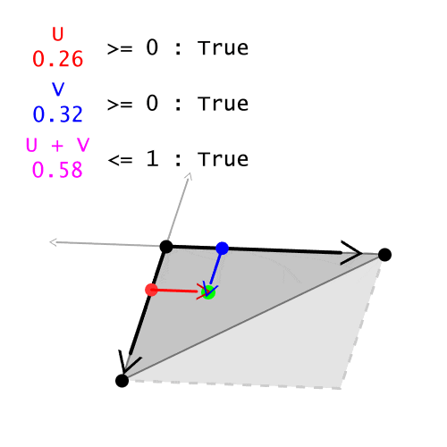

# qTriangle [](https://raw.githubusercontent.com/Wunkolo/qTriangle/master/LICENSE)

qTriangle is a personal study to design a **q**uick way to rasterize **Triangle**s by optimizing the and vectorizing the Point-In-Triangle problem.

The domain of the Point-In-Triangle problem is determining if a cartesian coordinate happens to land upon the interior of a triangle. In this case the 2D case of triangles will be examined and will require some kind of surface **area** for a point to land on so a case in which all three points are collinear(which is the worst case of having a *very* slim triangle) are ruled out.

This problem comes up a lot in the domain of computer graphics and game-play programming at times. Sometimes it's testing if a single point lands upon a polygon(made up of triangles) and sometimes it's testing if thousands of points happen to land on a triangle or not(such as when rendering a vector triangle against a regular grid during rasterization).

There are two primary formula to test if a point happens to land within a triangle in 2D space.

# Cross Product Method

The cross-product operation in vector algebra is a binary operation that takes two vectors in 3D space and creates a new vector that is perpendicular to them both. You can think of the two vectors as describing some kind of plane in 2D space, and the cross product creates a new vector that is perpendicular to this plane. Though, there are two ways to create a vector perpendicular to a plane, by going "in" the plane and going "out" the plane.

The Cross-Product has a lot of useful properties but one of interest at the moment is the **magnitude** of the resulting vector of the cross product which will be the **area** of the parallelogram that the two original vectors create. Since the points are on the X-Y plane in 3D space this *magnitude* will always be the Z-component of the cross product since all vectors perpendicular to the X-Y plane will take the form `[ 0, 0, (some value)]`. This becomes useful later on.


The particular numerical value of this area is not of importance either but rather the *parity* of the area is of interest(while a negative-surface-area does not make sense, this value tells us something about two directional vectors). Notice that whenever the direction to the moving point goes to the "left" of the black directional vector, that the area becomes negative, but when it is to the "right", the area is positive.
This is due to the [right hand rule](https://en.wikipedia.org/wiki/Right-hand_rule) where the direction of positive-rotation being **clockwise** or **counter-clockwise** causes the order of the original two directional vectors to determine the proper orientation of the cross product.

The parity of the cross-product-area depending on which side the direction of the "point" lands on solves the problem at the same tone of turning each edge into a linear inequality then testing if the point solves each of them at once but in a somewhat more optimal way.

The three positional vectors of the triangle must be in **clockwise** or **counter-clockwise** order so that three directional vectors can be determinately created.
```
EdgeDir0 = Vertex1 - Vertex0
EdgeDir1 = Vertex2 - Vertex1
EdgeDir2 = Vertex0 - Vertex2
```
Then, three additional directional vectors can be made that point from the triangle vertex position to the point that is being tested against
```
PointDir0 = Point - Vertex0
PointDir1 = Point - Vertex1
PointDir2 = Point - Vertex2
```

Now, finding out if a point lands within the triangle is determined by using three cross-products, and checking if each area is positive. If they are all positive. Then the point is to the "right" of all the edges. If any of them are negative, then it is not within the triangle.
```
| EdgeDir0 × PointDir0 | >= 0 &&
| EdgeDir1 × PointDir1 | >= 0 &&
| EdgeDir2 × PointDir2 | >= 0
```


## Optimizations

Previously it was determined that all cross products against the X-Y plane will take the form `[ 0, 0, (some value)]`. With this the arithmetic behind the cross-product operation can be much more simplified. Since the cross product can be [calculated using partial determinants of a 3x3 matrix](https://en.wikipedia.org/wiki/Rule_of_Sarrus) then attention only has to be given to the calculations that determine the Z-component alone which is but a 2x2 determinant of the two input vectors.

This means that if I had two vectors `A` and `B` on the X-Y plane. The cross-product's magnitude is simply:
```
A.x * B.y - A.y * B.x;
```
which reduces the previous arithmetic to:
```
EdgeDir0.x * PointDir0.y - EdgeDir0.y * PointDir0.x >= 0 &&
EdgeDir1.x * PointDir1.y - EdgeDir1.y * PointDir1.x >= 0 &&
EdgeDir2.x * PointDir2.y - EdgeDir2.y * PointDir2.x >= 0
```

The full pseudo-code:
```cpp
// Point       - Position that is being tested
// Vertex0,1,2 - Vertices of the triangle in **clockwise order**

// Directional vertices along the edges of the triangle in clockwise order
EdgeDir0 = Vertex1 - Vertex0
EdgeDir1 = Vertex2 - Vertex1
EdgeDir2 = Vertex0 - Vertex2

// Directional vertices pointing from the triangle vertices to the point
PointDir0 = Point - Vertex0
PointDir1 = Point - Vertex1
PointDir2 = Point - Vertex2

// Test if each cross-product results in a positive area
if(
	EdgeDir0.x * PointDir0.y - EdgeDir0.y * PointDir0.x >= 0 &&
	EdgeDir1.x * PointDir1.y - EdgeDir1.y * PointDir1.x >= 0 &&
	EdgeDir2.x * PointDir2.y - EdgeDir2.y * PointDir2.x >= 0
)
{
	// CurPoint is in triangle!
}
```

## Scaling

If I was to throw thousands of points at a triangle in a for-loop using this algorithm then not all variables have to be re-calculated for each point.

The vectors `EdgeDir0`, `EdgeDir1`, `EdgeDir2` only have to be calculated once. For each point the vectors `PointDir0`, `PointDir1`, `PointDir2` have to be recreated.

```
EdgeDir0 = Vertex1 - Vertex0
EdgeDir1 = Vertex2 - Vertex1
EdgeDir2 = Vertex0 - Vertex2
foreach(CurPoint in LotsOfPoints)
{
	PointDir0 = Point - Vertex0
	PointDir1 = Point - Vertex1
	PointDir2 = Point - Vertex2
	if(
		EdgeDir0.x * PointDir0.y - EdgeDir0.y * PointDir0.x >= 0 &&
		EdgeDir1.x * PointDir1.y - EdgeDir1.y * PointDir1.x >= 0 &&
		EdgeDir2.x * PointDir2.y - EdgeDir2.y * PointDir2.x >= 0
	)
	{
		// CurPoint is in triangle!
	}
}
```
Which results in the total overhead for each point being

Subtractions|Multiplications|Comparisons
:-:|:-:|:-:
9|6|3

# Barycentric Coordinate Method

With some barycentric coordinate trickery one can derive a coordiante system that allows a triangle to be described as a parametric plane of two vectors and two scalars.

The Barycentric coordinates of a triangle involves it's three position-vectors `p1`, `p2`, `p3`.
Using these three points, any new point `p'` within this triangle can be generated by *mixing* the three vertex positions according to three scalar weights `w1`, `w2`, `w3` such that:
`p' = w1 * p1 + w2 * p2 + w3 * p3`.
This is just a linear combination of three points, but `p'` isnt meant to just be any wild combination of three points. What you actually want is for the combination of three points to always land on the triangular surface that they all contain. This is called a [convex combination](https://en.wikipedia.org/wiki/Convex_combination) where if you want to only reach every point within this triangle then you must bind these three weights to the conditions of being non-negative and also summing to `1`. Making this the full barycentric equation for a triangle defined by three points:

`w1 >= 0`, `w2 >= 0`, `w3 >= 0`, `w1 + w2 + w3 = 1`

`p' = w1 * p1 + w2 * p2 + w3 * p3`

In this case though. **We already have `p'` and want to determine if it is within this triangle!** Time to cleverly work backwards!

So given a `p1`, `p2`, `p3` and `p'`, you have to figure out the three unknowns `w1`, `w2`, `w3` .

You could always just use the distance formula from `p'` to the others and invert it to get weights, and check it against the convex combination conditions to see if its within the triangle.

---

The two directional vectors are derived from three points that describe a plane while the two scalars are typically denoted as *U* and *V* and determine how much these two directional vectors should mix together to create another point on this plane.
Since a triangle has three points, these two vectors can be derived by picking any one point of the triangle and obtaining two directional vectors from this point to the two other points.

The *U* and *V* scalar values are typically normalized within the [0.0,1.0] range to easily translate these values into *percentages* that determine how much much the two vectors should contribute to the resulting vector.
Ex, if I had the two directional vectors `( 8, 2 )` and `( 7, 1 )` and the `U` `V` values `0.5` `1.0` respectively. The resulting point is ` ( 8, 2 ) * 0.5 + ( 7, 1 ) * 1.0 = ( 11, 3 )` which in english would be something like `I want 50% of the ( 8, 2 ) direction and 140% of ( 7, 1 )`.

The actual *triangle shape* is made by constraining the `U` and `V` values so that rather than describing a plane very generally it instead will stay within the bounds of a triangle.


The first two constraints are `U >= 0` and `V >= 0` which guarentee that the U,V coordinates are always on the *positive* side of the two vectors and do not go backwards, off the triangle. The third constraint is `U + V <= 1` is [just the line](http://www.wolframalpha.com/input/?i=1+-+x+-+y++%3D+0) `y = 1 - x` [turned into an inequality](http://www.wolframalpha.com/input/?i=1+-+x+-+y++%3D%3E+0) such that all solutions to the inequality equate to a point within a triangle. The actual derivation of this involves some barycentric coordinate limbo.


Given a triangle, the two directional vectors are easy to calculate. Pick any of the three points of a triangle, get the vector direction from this point, to the two other points ( which is just a vector subtraction). After the two directional vectors are obtained, now all that has to be done to see if a point is within a triangle is [*projecting*](https://en.wikipedia.org/wiki/Vector_projection) this point against the two directional vectors to get the *U* and *V* values to test against the three conditions.

Projecting a point against these two vectors to get the *U* and *V* values is but trivial dot-product arithmetic. First, another directional vector has to be created as a positional-vector and a directional-vector wouldn't make sense in this instance. The very same point that was selected to in step 1 to generate the first two directional vectors must be used once more to generate a third directional vector between this triangle vertex and the point being sampled against (another vector subtraction). This new vector will then be dot-product-ed against the two directional edges ( vertial vector multiplication and horizontal addition ) to finally determine the `U` and `V` values to test against `U >= 0`, `V >= 0`, and `U + V <= 1`.

