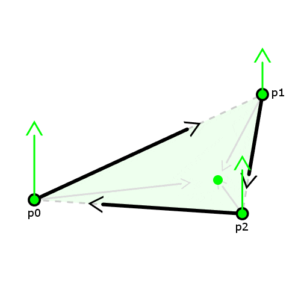

# qTriangle 

qTriangle is a personal study to design a **q**uick way to rasterize **Triangles** by optimizing the and vectorizing the Point-In-Polygon problem.

|||
|:-:|:-:|
Cross Product|Barycentric
|